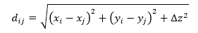

# Требования к программе.
Программа должна позволять пользователю просматривать / добавлять / редактировать / удалять такие объекты, как события в некоторой системе.

У каждого события есть три поля: название (строковое значение), приоритет (целое число от 1 до 5), временная метка (timestamp, т.е. дата и время возникновения).

Также каждое событие относится к некоторой категории. Программа должна позволять просматривать / добавлять / удалять категории.

Эти категории должны быть организованы в иерархическую структуру, т.е. у каждой категории может быть одна родительская категория, а также произвольное количество дочерних категорий.

Программа должна позволять рассчитывать матрицу D – матрицу расстояния между имеющимися объектами. Размер этой матрицы n × n, где n – это имеющееся количество объектов. Элемент матрицы dij равен расстоянию между i-ым и j-ым объектами. Матрица расстояния должна получаться симметричной относительно главной диагонали.

Расстояние между двумя событиями определяется по формуле Евклидового расстояния;

где все координаты x, y и z – это вещественные числа от 0 до 1;

где p – это приоритет события;

где t – это числовое значение поля timestamp события в миллисекундах (сколько миллисекунд прошло от 1 января 1970 года, 00:00:00 до события);

tmin и tmax – это минимальное и максимальное из числовых значений поля timestamp по всем событиям;

z - это нормированное расстояние между категориями двух событий. Ненормированное расстояние равно кратчайшему пути между одной и второй категорией в графе (дереве) категорий, или это количество переходов от категории к родительской или дочерней категории, необходимое, чтобы дойти до второй категории, например, в следующем дереве категорий:

  

├ category 1
│   ├ category 1.1
│   └ category 1.2
│       └ category 1.2.1
└ category 2
    ├ category 2.1
    └ category 2.2

расстояние между категорией «category 1.2.1» и категорией «category 2.2» будет равно 5: «category 1.2.1» – «category 1.2» – «category 1» – «корневая категория» – «category 2» – «category 2.2».

Нормированное же расстояние будет равно отношению ненормированного расстояния к максимальному расстоянию, возможному в существующем дереве категорий.

  
# Критерии оценивания проектов

1. Полнота и правильность реализации требований.
2. Обоснованность выбора и правильность использования парадигмы программирования (структурное/процедурное, функциональное, объектно-ориентированное и т.д.).
3. Понятность и логичность структурированности программного кода.
4. Выступление и ответы на вопросы на защите проекта.